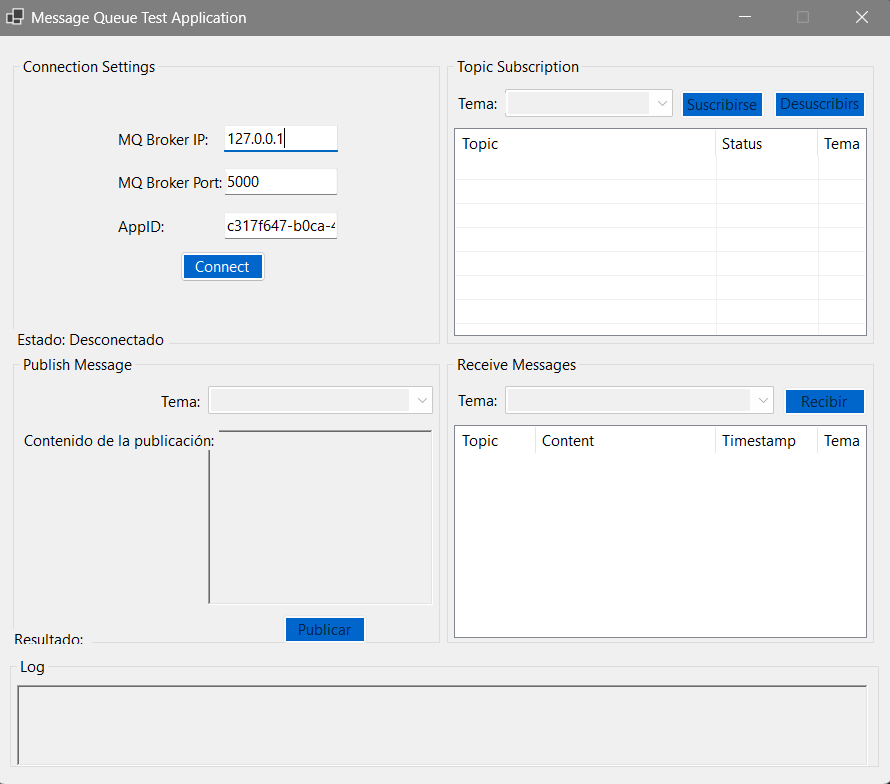
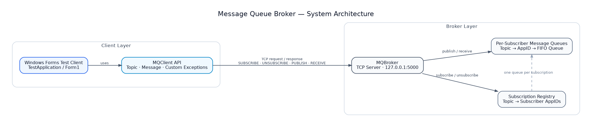
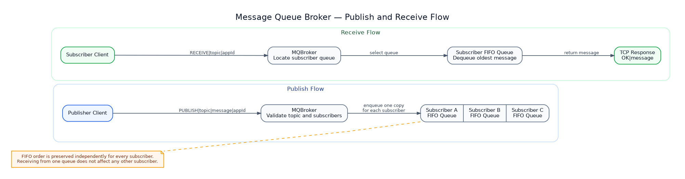
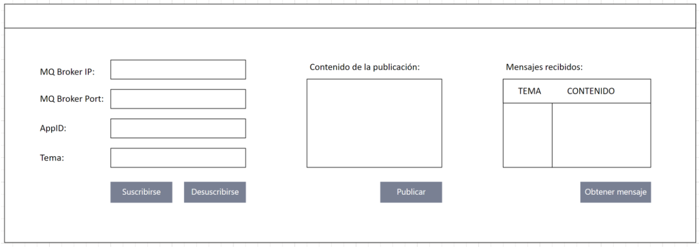

# Message Queue Broker

> An in-memory publish–subscribe message broker implemented in C# with
> TCP communication, custom generic data structures, FIFO delivery
> queues, concurrent request handling, and a Windows Forms test client.

This project was developed collaboratively for
**CE1103 — Algoritmos y Estructuras de Datos I** at the
**Instituto Tecnológico de Costa Rica**.

The system demonstrates the design of a small message-oriented middleware
platform using TCP sockets, custom collection implementations, concurrent
request processing, and independent message queues for each subscriber.

The current desktop interface is available in Spanish.

<p align="center">
  
</p>

## Table of Contents

- [Overview](#overview)
- [Key Features](#key-features)
- [System Architecture](#system-architecture)
- [Message Flow](#message-flow)
- [Class Diagram](#class-diagram)
- [Custom Data Structures](#custom-data-structures)
- [Communication Protocol](#communication-protocol)
- [Technology Stack](#technology-stack)
- [Repository Structure](#repository-structure)
- [Getting Started](#getting-started)
- [Build and Run](#build-and-run)
- [Manual Validation](#manual-validation)
- [Interface Design](#interface-design)
- [Design Decisions](#design-decisions)
- [Known Limitations](#known-limitations)
- [Development](#development)
- [Project Status](#project-status)

## Overview

The system implements a topic-based publish–subscribe model:

1. A client connects to the broker using an IP address, port, and unique `AppID`.
2. The client subscribes to one or more topics.
3. A publisher sends a message to a topic.
4. The broker places a copy of that message in the FIFO queue of every subscriber registered for the topic.
5. Each subscriber retrieves its own messages independently.
6. A client can unsubscribe from a topic and remove its associated queue.

The implementation is divided into three .NET projects:

- **MQBroker:** TCP server, subscription registry, and message queues.
- **MQClient:** reusable client API and protocol-specific exceptions.
- **TestApplication:** Windows Forms interface for connecting, subscribing, publishing, and receiving messages.

## Key Features

- Topic-based publish–subscribe communication.
- Independent FIFO queue for each `(topic, subscriber)` pair.
- Unique client identification through `Guid` values.
- Subscribe and unsubscribe operations.
- Message publication to all subscribers of a topic.
- Pull-based message retrieval.
- Concurrent client handling through the .NET `ThreadPool`.
- Synchronization of shared broker state.
- Custom implementations of a dynamic list, circular queue, dictionary, and equality comparator.
- Client-side validation and operation-specific exceptions.
- Windows Forms test interface with connection state, logs, subscriptions, and received-message history.
- Console client test for validating the complete workflow.

## System Architecture

The system is divided into a Windows Forms client, a reusable client API,
and a TCP message broker responsible for subscriptions and message delivery.

<p align="center">
  
</p>

The Windows Forms application uses the `MQClient` API to send operations to
the broker through TCP. The broker maintains a subscription registry and an
independent FIFO message queue for every subscribed client.

## Message Flow

The broker follows a topic-based publish–subscribe model. A published message
is copied into the independent FIFO queue of every client subscribed to the
target topic.

<p align="center">
  
</p>

During a receive operation, the broker locates the queue associated with the
requested topic and `AppID`, removes the oldest available message, and returns
it to the client.

FIFO order is preserved independently for each subscriber. Receiving a
message from one queue does not modify the queues of other subscribers.
## Class Diagram

The diagram below is a simplified view of the main project classes and their relationships.

<p align="center">
  
</p>

The Mermaid source used to generate the image can be stored at:

```text
docs/diagrams/message-queue-class-diagram.mmd
```

## Custom Data Structures

The broker intentionally avoids the standard .NET collections for its central storage.

### `MyList<T>`

A dynamically resized array used to store subscribers and dictionary entries.

Main operations:

- `Add`
- `Contains`
- `Remove`
- indexed access
- `ToArray`

### `MyQueue<T>`

A circular FIFO queue used to store pending messages for each subscriber.

Main operations:

- `Enqueue`
- `Dequeue`
- `Peek`
- `Count`

### `MyDictionary<TKey, TValue>`

A key-value structure backed by `MyList<T>`.

Main operations:

- `Add`
- `ContainsKey`
- `Remove`
- indexed key access
- `Keys`

### Broker Storage Model

Conceptually, the broker maintains:

```text
subscribers:
    topic → list of AppIDs

message queues:
    topic → AppID → FIFO queue of messages
```

## Communication Protocol

The broker and client exchange UTF-8 text messages separated by the pipe character (`|`).

### Requests

| Operation | Request format |
|---|---|
| Subscribe | `SUBSCRIBE|topic|appId` |
| Unsubscribe | `UNSUBSCRIBE|topic|appId` |
| Publish | `PUBLISH|topic|message|appId` |
| Receive | `RECEIVE|topic|appId` |

### Responses

| Type | Format | Meaning |
|---|---|---|
| Success | `OK|details` | The operation completed successfully |
| Error | `ERROR|details` | The request was invalid or could not be completed |

### Example

```text
SUBSCRIBE|Tema/Noticias/Tecnologia|c317f647-b0ca-4d67-91c3-8a094a5e5718
OK|Suscripción exitosa
```

```text
PUBLISH|Tema/Noticias/Tecnologia|Nuevo mensaje|c317f647-b0ca-4d67-91c3-8a094a5e5718
OK|Mensaje publicado a 2 suscriptores
```

## Technology Stack

- **Language:** C#
- **Runtime:** .NET 8
- **Networking:** `TcpListener`, `TcpClient`, `NetworkStream`
- **Concurrency:** `ThreadPool`, `lock`
- **Desktop UI:** Windows Forms
- **Data structures:** custom generic list, queue, dictionary, and comparator
- **Development environment:** Visual Studio 2022
- **Protocol:** custom request-response protocol over TCP

## Repository Structure

```text
.
├── MessageQueueSystem/
│   ├── MQBroker/
│   │   ├── MQBroker.cs
│   │   └── MQBroker.csproj
│   ├── MQClient/
│   │   ├── MQClient.cs
│   │   ├── Prueba.cs
│   │   └── MQClient.csproj
│   ├── TestApplication/
│   │   ├── Form1.cs
│   │   ├── Form1.Designer.cs
│   │   ├── Program.cs
│   │   └── TestApplication.csproj
│   └── MessageQueueSystem.sln
├── docs/
│   ├── diagrams/
│   │   └── message-queue-class-diagram.mmd
│   └── images/
│       ├── interfaz.png
│       ├── message-queue-class-diagram.png
│       └── req.png
└── README.md
```

## Getting Started

### Prerequisites

- Git
- .NET 8 SDK
- Windows 10 or 11 for the Windows Forms client
- Visual Studio 2022 is optional but recommended for opening the complete solution

### Clone the Repository

```bash
git clone https://github.com/Sarimoca/Proyecto1_Datos1_S1_2025.git
cd Proyecto1_Datos1_S1_2025/MessageQueueSystem
```

### Restore Dependencies

The project uses only the .NET platform libraries, but the solution should still be restored before building:

```bash
dotnet restore MessageQueueSystem.sln
```

## Build and Run

### Build the Complete Solution

```bash
dotnet build MessageQueueSystem.sln
```

### Start the Broker

Open a terminal inside `MessageQueueSystem`:

```bash
dotnet run --project MQBroker/MQBroker.csproj
```

The broker starts with the configuration defined in `MQBroker.cs`:

```text
IP address: 127.0.0.1
Port:       5000
```

Keep the broker running while using either client.

### Start the Windows Forms Client

Open a second terminal:

```bash
dotnet run --project TestApplication/TestApplication.csproj
```

In the interface:

1. Enter `127.0.0.1` as the broker IP.
2. Enter `5000` as the broker port.
3. Keep the generated `AppID` or provide another valid GUID.
4. Select **Connect**.
5. Subscribe to a topic.
6. Publish or retrieve messages.

### Run the Console Client Test

With the broker running, execute:

```bash
dotnet run --project MQClient/MQClient.csproj
```

The console test subscribes, publishes, receives, and unsubscribes using a generated client identifier.

## Manual Validation

A complete publish–subscribe validation can be performed with two client instances:

1. Start the broker.
2. Open two instances of `TestApplication`.
3. Connect both clients to `127.0.0.1:5000`.
4. Subscribe both clients to the same topic.
5. Publish a message from either client.
6. Retrieve the message from the first client.
7. Retrieve the same message from the second client.
8. Publish several messages and verify that each subscriber receives them in FIFO order.
9. Unsubscribe one client.
10. Publish another message and verify that only the remaining subscriber can retrieve it.

## Interface Design

### Implemented Interface

<p align="center">
  
</p>

The interface includes:

- broker connection settings;
- generated or custom `AppID`;
- topic subscription controls;
- message publication controls;
- received-message table;
- subscription status table;
- operation result area;
- timestamped activity log.

### Initial Interface Mockup

<p align="center">
  
</p>

The mockup shows the original interface requirements used before implementing the Windows Forms client.

## Design Decisions

### Per-Subscriber Queues

Each subscriber receives an independent queue for every subscribed topic. Reading a message from one subscriber does not remove it from another subscriber's queue.

### FIFO Delivery

`MyQueue<T>` uses a circular-array implementation, preserving insertion order while avoiding element shifting during dequeue operations.

### Request-Response TCP Model

Each client operation creates a connection, sends one command, waits for one response, and closes the connection. This keeps the protocol simple for an academic implementation.

### Custom Collections

The broker uses custom generic collections to demonstrate dynamic arrays, circular queues, indexed key-value storage, and generic equality comparison.

### Concurrent Request Handling

The broker accepts incoming connections sequentially and dispatches each client to the .NET `ThreadPool`. Shared subscription and queue state is protected during broker operations.

### Client-Specific Exceptions

The client translates broker and socket failures into operation-specific exceptions:

- `MQClientException`
- `MQSubscriptionException`
- `MQPublishException`
- `MQReceiveException`

## Known Limitations

- All topics, subscriptions, and messages are stored only in memory.
- Broker state is lost when the process stops.
- The broker uses a fixed address and port in the current entry point.
- The protocol is delimiter-based; topic names and messages containing `|` are not safely encoded.
- Each request and response is read through a single fixed-size buffer.
- The receive operation uses client polling rather than server push.
- Shared broker operations use coarse-grained synchronization.
- The system does not provide authentication, authorization, TLS encryption, acknowledgements, retries, or durable delivery.
- The Windows Forms client is available only on Windows.
- The implementation is an academic prototype and is not intended as a production message broker.

## Development

This project was developed collaboratively by Computer Engineering
students at Instituto Tecnológico de Costa Rica.

- [Antony Javier Hernández Castillo](https://github.com/habycr) 
- [Samuel Ricardo Morales Cascante](https://github.com/Sarimoca)


**Course:** CE1103 — Algoritmos y Estructuras de Datos I  
**Institution:** Instituto Tecnológico de Costa Rica

## Project Status

**Completed academic prototype.**

The repository is being curated for technical documentation and portfolio presentation. No production deployment is provided.
